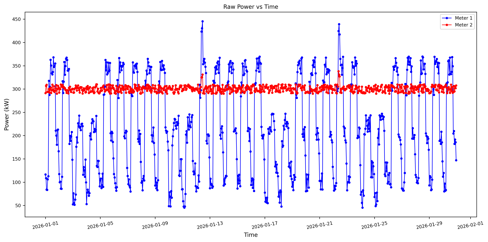

# Analyse et gestion de la consommation énergétique

Projet d’analyse et d’optimisation de la consommation énergétique sur 2 compteurs simulés sur 30 jours. Utilisation combinée de **SQL** et **Python** pour détecter anomalies, analyser séries temporelles et simuler des stratégies de gestion de la demande énergétique (DSM) dans un contexte industriel ou tertiaire.

---

## 🎯 Objectifs
- Génération de données énergétiques réalistes  
- Analyse statistique et exploratoire des séries temporelles  
- Détection des anomalies et identification des heures critiques  
- Corrélation puissance–température et modélisation  
- Optimisation énergétique via DSM (clipping, load shifting, load reduction)

---

## ⚙️ Contexte
- Données simulées : 30 jours, résolution horaire  
- Profils :  
  - Compteur 1 : bâtiment tertiaire (HVAC, dynamique)  
  - Compteur 2 : process industriel (charge stable)  
- Ajout de bruit et pics ponctuels pour tester la détection d'anomalies  
- Variables : meter_id, timestamp, power_kw

---

## 🧰 Technologies
**Langages :** SQL, Python   

**Bibliothèques Python :** pandas, numpy, matplotlib, seaborn, scipy, statsmodels, scikit-learn

---

## 🔁 Pipeline et analyse des données
### Pipeline du projet


### Analyse SQL
- Génération de données synthétiques
- Statistiques et variabilité de la puissance (moyenne, max, min, CV, FP)
- Pics et heures creuses, détection des anomalies (Z_score, Z_robuste)
- Analyse temporelle et comparaisons journalières pour identifier motifs et irrégularités
- Comparaison semaine vs week-end : statistiques, énergie cumulée, ratio semaine/week-end

### Analyse Python
- Prétraitement : nettoyage, structuration, gestion valeurs manquantes/aberrantes/doublons
- Visualisations : courbes temporelles, histogrammes, heatmaps
- Séries temporelles : autocorrélation, Rolling mean, CV
- Détection d’outliers : Z-score, Z-robuste, IIE, Isolation Forest
- Analyse température : corrélation puissance/température, décalage temporel (lag)
- Modélisation : régression linéaire, Random Forest
- Optimisation DSM : clipping (P95), load shifting, load reduction

---

## 🏗️ Structure du projet

```text
energy-demand-analytics/
│
├── README.md
├── requirements.txt
│
├── data/
│   └── energy_readings_month.csv
│
├── sql/
│   ├── 01_generate_energy_data.sql
│   └── 02_energy_analysis.sql
│
├── python/
│   ├── 01_data_loading_cleaning.py
│   ├── 02_exploratory_analysis.py
│   ├── 03_time_series_analysis.py
│   ├── 04_anomaly_detection.py
│   ├── 05_temperature_correlation.py
│   ├── 06_machine_learning_models.py
│   └── 07_demand_side_management.py
│
├── notebooks/
│   └── energy_analysis_pipeline.ipynb
│
├── reports/
│   └── energy_analysis_pipeline.html
│
├── results/
│   ├── power_timeseries.png
│   ├── heatmap_power.png
│   ├── anomaly_detection.png
│   ├── temperature_correlation.png
│   └── demand_management.png
│
└── .gitignore
```

---

## ▶️ Comment exécuter

```bash
# Cloner le dépôt
git clone https://github.com/FatehChaabat/energy-demand-analytics.git
cd energy-demand-analytics

# Installer les dépendances
pip install -r requirements.txt

# Exécuter les scripts Python dans l’ordre
python python/01_data_loading_cleaning.py       
python python/02_exploratory_analysis.py        
python python/03_time_series_analysis.py        
python python/04_anomaly_detection.py          
python python/05_temperature_correlation.py    
python python/06_machine_learning_models.py     
python python/07_demand_side_management.py      

# OU ouvrir le notebook interactif
jupyter notebook notebooks/energy_analysis_pipeline.ipynb

# OU consulter directement le rapport HTML statique
reports/energy_analysis_pipeline.html
```

---

## 📈 Résultats clés
- Identification précise des heures critiques de consommation  
- Détection d’outliers par méthodes statistiques et Machine Learning  
- Analyse de la corrélation puissance–température et estimation du temps de réponse thermique
- Modélisation prédictive : régression linéaire et Random Forest 
- Quantification des économies et adaptation des stratégies DSM selon profils dynamiques ou stables

---

## 📈 Principaux Insights Visuels
**Séries temporelles :** comparaison des profils horaires de puissance entre les deux compteurs  
  

**Heatmap :** visualisation de la puissance par heure et par jour pour les deux compteurs, mettant en évidence minima, maxima, cycles journaliers et pics via l’intensité des couleurs
  

**Détection d’anomalies :** identification des pics anormaux pour les deux compteurs via méthodes statistiques (Z-score, Z-robuste) et Machine Learning (Isolation Forest)
  

**Corrélation température :** modélisation de la relation température–puissance pour le compteur 1 via régression linéaire et Random Forest (Lag 0 et Lag optimal)
  

**Gestion DSM :** consommation énergétique des deux compteurs après application du clipping (P95), du load shifting et de la load reduction
   

---

## 🏭 Applications
- Monitoring énergétique industriel et tertiaire
- Gestion intelligente des bâtiments (HVAC)  
- Détection d’anomalies sur réseaux électriques  
- Optimisation de la consommation énergétique

---

## 🚀 Améliorations futures
- Intégration de données réelles  
- Développement de modèles de prévision avancés  
- Dashboards interactifs et suivi énergétique en temps réel  

---

## 👤 Auteur
Ingénieur en **mécanique des fluides et systèmes énergétiques**, avec un intérêt pour l’analyse de données, la modélisation et l’optimisation énergétique.
