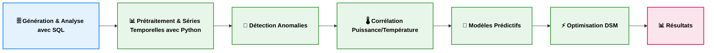
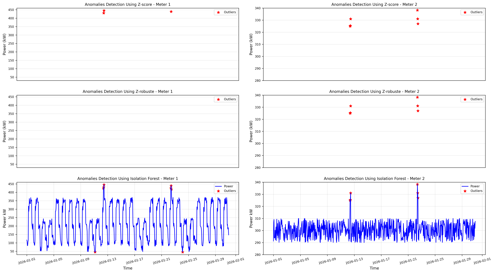
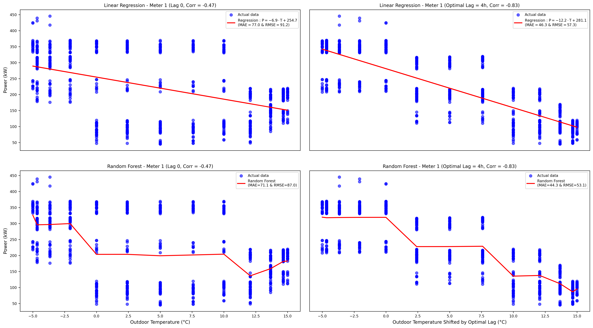
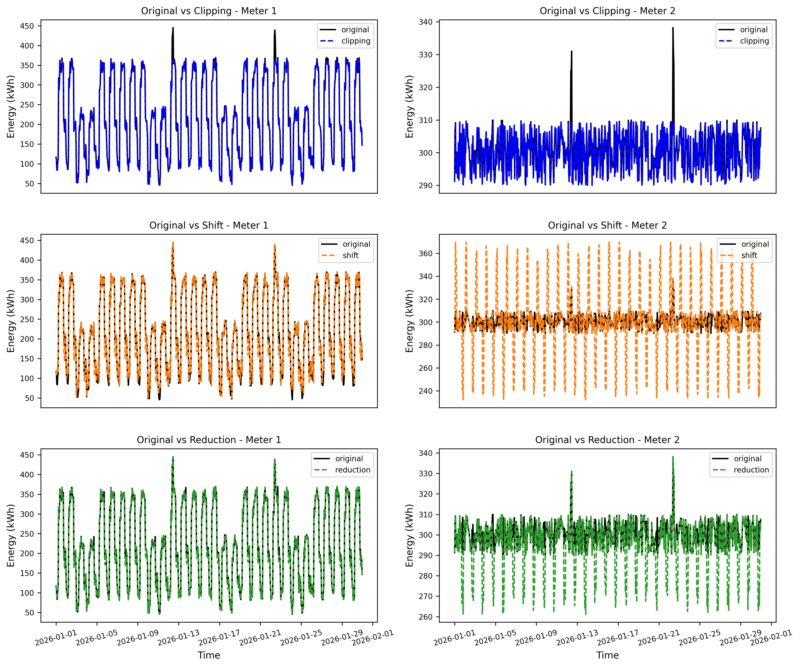

# Analyse et Optimisation de la Consommation Énergétique

Pipeline complet d’analyse énergétique combinant **SQL** et **Python** pour la détection d’anomalies, la modélisation thermique et l’optimisation de la demande (DSM).


---

## 🚀 Aperçu du projet

- **Détection d’anomalies :** Approche hybride combinant Z-Score et Isolation Forest

- **Modélisation :** Analyse de la corrélation puissance–température via régression linéaire et Random Forest

- **Optimisation :** Réduction des pics de consommation via des stratégies DSM (Clipping , load shifting, load reduction)  

---

## 🎯 Objectifs & Valeur Métier
Le but est de transformer des données brutes de compteurs en leviers décisionnels :

- **Réduction des coûts :** Éviter les pénalités liées aux dépassements de puissance souscrite

- **Maintenance préventive :** Détecter les dérives de consommation (anomalies) avant les défaillances

- **Caractérisation thermique :** Analyser la corrélation puissance–température pour isoler la part de consommation liée au climat (chauffage/clim)

- **Modélisation prédictive :** Développer des modèles pour anticiper la demande énergétique (Régression Linéaire, Random Forest)

- **Efficacité énergétique :** Simuler des stratégies DSM (Demand Side Management) pour lisser la courbe de charge

---

## ⚙️ Stack & Données
 - **Données :** 30 jours (résolution horaire) | Compteur 1 (Tertiaire/HVAC) vs Compteur 2 (Industriel/Stable) | Variables (meter_id, timestamp, power_kw)

- **Architecture :**

  - **SQL Server :** Simulation de données, Nettoyage initial et Agrégations statistiques lourdes

  - **Python :** Nettoyage approfondi, Analyse de séries temporelles, Machine Learning (Scikit-Learn) et Visualisation (Seaborn/Matplotlib)

- **Pipeline :** Architecture modulaire orchestrée via `main.py`

---

## 🔁 Pipeline



---

## 📈 Résultats clés

- **Hybridation efficace :** La combinaison Z-Score + Isolation Forest permet une détection d'anomalies robuste sur les deux profils

- **Signature Thermique :** Le profil tertiaire affiche une forte corrélation température/puissance, contrairement au profil industriel

- **Performance du Random Forest :** Ce modèle surpasse la régression linéaire en capturant les non-linéarités et les dynamiques temporelles

- **Efficacité du DSM :** Réduction significative des pointes de charge sans altération de la consommation énergétique totale

---

## 📊 Visualisations

Les figures suivantes illustrent les principaux résultats du pipeline : 

<p align="center">


<em><b>Heatmap de consommation :</b> On observe clairement une rupture de charge le week-end sur le compteur tertiaire, typique d'une gestion programmée du bâtiment (HVAC), contrairement au profil industriel plus stable.</em>
</p>

<p align="center">



<em><b>Détection d’anomalies :</b> Identification des pics critiques. L'approche hybride permet d'isoler les dérives ponctuelles tout en ignorant le "bruit" normal de l'activité.</em>
</p>

<p align="center">



<em><b>Signature Thermique :</b> Le modèle <b>Random Forest</b> capte mieux les non-linéarités et l'inertie thermique du système que la régression linéaire classique.</em>
</p>

<p align="center">



<em><b>Optimisation DSM :</b> Visualisation de l'écrêtage (Clipping), du déplacement de charge (Shifting) ainsi que la réduction de charge pour lisser la courbe de puissance.</em>
</p>

---

## 🏭 Applications

- **Monitoring énergétique :** Suivi et analyse des consommations pour bâtiments tertiaires et sites industriels  

- **Gestion des systèmes HVAC :** Optimisation des équipements thermiques en fonction des conditions climatiques 

- **Maintenance conditionnelle :** Détection précoce des dérives de consommation et des comportements anormaux

- **Optimisation de la demande (DSM) :** Réduction des pics de puissance et amélioration du profil de charge 

- **Aide à la décision :** Support au dimensionnement des contrats énergétiques et au pilotage des coûts

---

## 🚀 Améliorations

- **Données réelles :** Intégration de données issues de capteurs ou de systèmes de supervision (SCADA)

- **Prévision avancée :** Mise en place de modèles de séries temporelles pour anticiper la demande énergétique  

- **Temps réel :** Déploiement d’un pipeline de traitement en continu pour le monitoring et la détection d’anomalies en temps réel 

- **Visualisation :** Développement de dashboards interactifs (Power BI) pour le suivi opérationnel

- **Industrialisation :** Conteneurisation du projet (Docker) et automatisation du pipeline (CI/CD) 

- **Enrichissement des données :** Ajout de variables (météo réelle, occupation, calendriers) pour améliorer les modèles 

---

## 🏗️ Structure du projet

```text
energy-demand-analytics/
│
├── README.md                                       # Documentation principale
├── LICENSE                                         # Licence MIT                          
├── requirements.txt                                # Dépendances Python nécessaires
├── main.py                                         # Orchestrateur central du pipeline
│
├── data/                                           # Dataset généré
│   └── energy_readings_month.csv
│
├── sql/                                            # Scripts SQL (Simulation & Analyse)
│   ├── 01_generate_energy_data.sql
│   └── 02_energy_analysis.sql
│
├── python/                                         # Modules de traitement Python
│   ├── P1_data_loading_cleaning.py
│   ├── P2_exploratory_analysis.py
│   ├── P3_time_series_analysis.py
│   ├── P4_anomaly_detection.py
│   ├── P5_temperature_correlation.py
│   ├── P6_machine_learning_models.py
│   ├── P7_demand_side_management.py
│   └── __init__.py
│
├── notebooks/                                      # Analyse interactive
│   └── energy_analysis_pipeline.ipynb
│
├── results/                                        # Graphiques exportés
│   ├── 01_power_timeseries.png
│   ├── 02_power_distribution.png
│   ├── 03_heatmap_power.png
│   ├── 04_power_autocorrelation.png
│   ├── 05_power_and_rolling_mean.png
│   ├── 06_coefficient_of_variation.png
│   ├── 07_anomaly_detection.png
│   ├── 08_energy_instability_index.png
│   ├── 09_power-temperature_correlation.png
│   ├── 10_power_vs_temperature_lag.png
│   ├── 11_linear_regression_vs_random_forest.png
│   └── 12_demand_side_management.png
│
└── .gitignore                                    # Fichiers à exclure du contrôle de version
```

---

## ▶️ Comment exécuter

```bash

# Cloner le dépôt
git clone https://github.com/FatehChaabat/energy-demand-analytics.git
cd energy-demand-analytics

# Installer les dépendances
pip install -r requirements.txt

# Exécuter tout le pipeline avec main.py
python main.py      

# OU ouvrir le notebook interactif
jupyter notebook notebooks/energy_analysis_pipeline.ipynb

```

---

## 👤 Auteur
Ingénieur en **mécanique des fluides et systèmes énergétiques**, avec un intérêt pour l’analyse de données, la modélisation et l’optimisation énergétique. 

[](https://fatehchaabat.github.io)
[](https://www.linkedin.com/in/fateh-chaabat-08202aa9/)
[](https://github.com/FatehChaabat)
[](https://www.researchgate.net/profile/Fateh-Chaabat-2)

---

## 📄 Licence
Ce projet est sous **MIT License** – vous pouvez librement utiliser, modifier et partager le code et les fichiers, à condition de conserver la mention du copyright et de la licence.
