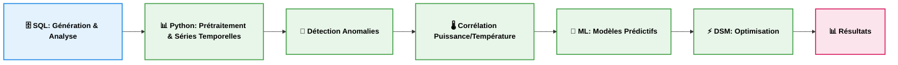
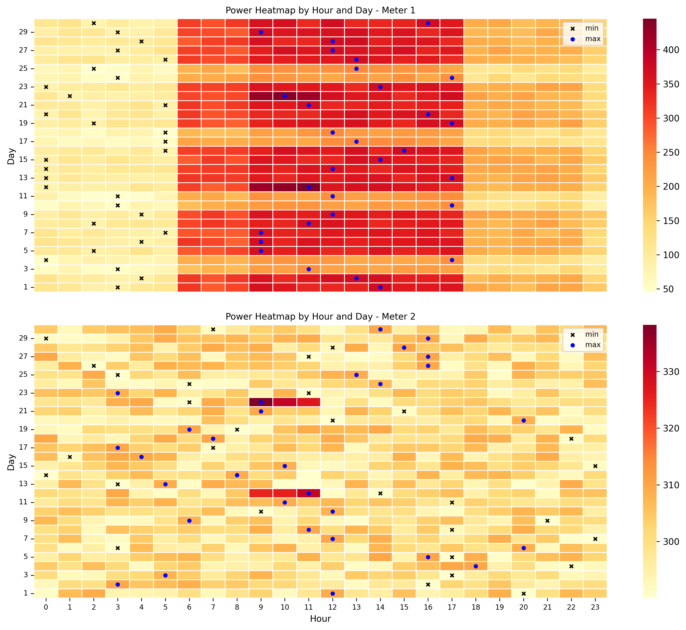

# Analyse avancée de la Consommation Énergétique

Détection d'anomalies via une approche hybride (SQL & Python) et optimisation de la demande énergétique (DSM).


---

## 🚀 Aperçu du projet

- **Détection d’anomalies :** Approche hybride combinant Z-Score et Isolation Forest

- **Modélisation :** Analyse de la corrélation puissance–température (signature thermique)

- **Optimisation :** Réduction des pics via stratégies DSM (Clipping P95, load shifting, load reduction)  

---

## 🎯 Objectifs & Valeur Métier
Le but est de transformer des données brutes de compteurs en leviers décisionnels :

- **Réduction des coûts :** Éviter les pénalités de dépassement de puissance souscrite.

- **Maintenance préventive :** Détecter les dérives de consommation (anomalies) avant la panne.

- **Caractérisation thermique :** Corrélation puissance–température pour isoler la part de consommation liée au climat (chauffage/clim).

- **Modélisation prédictive :** Développement de modèles pour anticiper la demande énergétique (Régression Linéaire, Random Forest).

- **Efficacité énergétique :** Simuler des stratégies DSM (Demand Side Management) pour lisser la courbe de charge.

---

## ⚙️ Stack & Données
 - **Données :** 30 jours (résolution horaire) | Compteur 1 (Tertiaire/HVAC) vs Compteur 2 (Industriel/Stable) | Variables (meter_id, timestamp, power_kw).

- **Architecture :**

  - **SQL Server :** Simulation de données, Nettoyage initial et Agrégations statistiques lourdes.

  - **Python :** Nettoyage approfondi, Analyse de séries temporelles, Machine Learning (Scikit-Learn) et Visualisation (Seaborn/Matplotlib).

- **Pipeline :** Architecture modulaire orchestrée via `main.py`

---

## 🔁 Pipeline



---

## 📈 Résultats clés

- **Hybridation efficace :** La combinaison Z-Score + Isolation Forest permet une détection d'anomalies robuste sur les deux profils.

- **Signature Thermique :** Le profil tertiaire affiche une forte corrélation température/puissance, contrairement au profil industriel.

- **Performance du Random Forest :** Ce modèle surpasse la régression linéaire en capturant les non-linéarités et les dynamiques temporelles.

- **Efficacité du DSM :** Réduction significative des pointes de charge sans altération de la consommation énergétique totale.

---

## 📊 Visualisations

Les figures suivantes illustrent les principaux résultats du pipeline :

**Séries temporelles :** comparaison des profils horaires de puissance entre les deux compteurs  
  

**Heatmap :** visualisation de la puissance par heure et par jour pour les deux compteurs, mettant en évidence minima, maxima, cycles journaliers et pics via l’intensité des couleurs
  

**Détection d’anomalies :** identification des pics anormaux pour les deux compteurs via méthodes statistiques (Z-score, Z-robuste) et Machine Learning (Isolation Forest)
  

**Corrélation température :** modélisation de la relation température–puissance pour le compteur 1 via régression linéaire et Random Forest (Lag 0 et Lag optimal)
  

**Gestion DSM :** consommation énergétique des deux compteurs après application du clipping (P95), du load shifting et de la load reduction
   

---

## 🏗️ Structure du projet

```text
energy-demand-analytics/
│
├── README.md
├── LICENSE
├── requirements.txt
├── main.py
│
├── data/
│   └── energy_readings_month.csv
│
├── sql/
│   ├── 01_generate_energy_data.sql
│   └── 02_energy_analysis.sql
│
├── python/
│   ├── P1_data_loading_cleaning.py
│   ├── P2_exploratory_analysis.py
│   ├── P3_time_series_analysis.py
│   ├── P4_anomaly_detection.py
│   ├── P5_temperature_correlation.py
│   ├── P6_machine_learning_models.py
│   ├── P7_demand_side_management.py
│   └── __init__.py
│
├── notebooks/
│   └── energy_analysis_pipeline.ipynb
│
├── results/
│   ├── 01_power_timeseries.png
│   ├── 02_heatmap_power.png
│   ├── 03_anomaly_detection.png
│   ├── 04_temperature_correlation.png
│   └── 05_demand_management.png
│
└── .gitignore
```

---

## ▶️ Comment exécuter

```bash

# Cloner le dépôt
git clone https://github.com/FatehChaabat/energy-demand-analytics.git
cd energy-demand-analytics

# Installer les dépendances
pip install -r requirements.txt

# Exécuter tout le pipeline avec main.py
python main.py      

# OU ouvrir le notebook interactif
jupyter notebook notebooks/energy_analysis_pipeline.ipynb

```

---

## 🏭 Applications
- Monitoring énergétique en temps réel
- Optimisation des systèmes HVAC  
- Détection précoce de dérives énergétiques
- Aide à la décision pour gestion DSM

---

## 🚀 Améliorations
- Intégration de données réelles  
- Développement de modèles de prévision avancés  
- Dashboards interactifs et suivi énergétique en temps réel  

---

## 👤 Auteur
Ingénieur en **mécanique des fluides et systèmes énergétiques**, avec un intérêt pour l’analyse de données, la modélisation et l’optimisation énergétique.

---

## 📄 Licence
Ce projet est sous **MIT License** – vous pouvez librement utiliser, modifier et partager le code et les fichiers, à condition de conserver la mention du copyright et de la licence.
